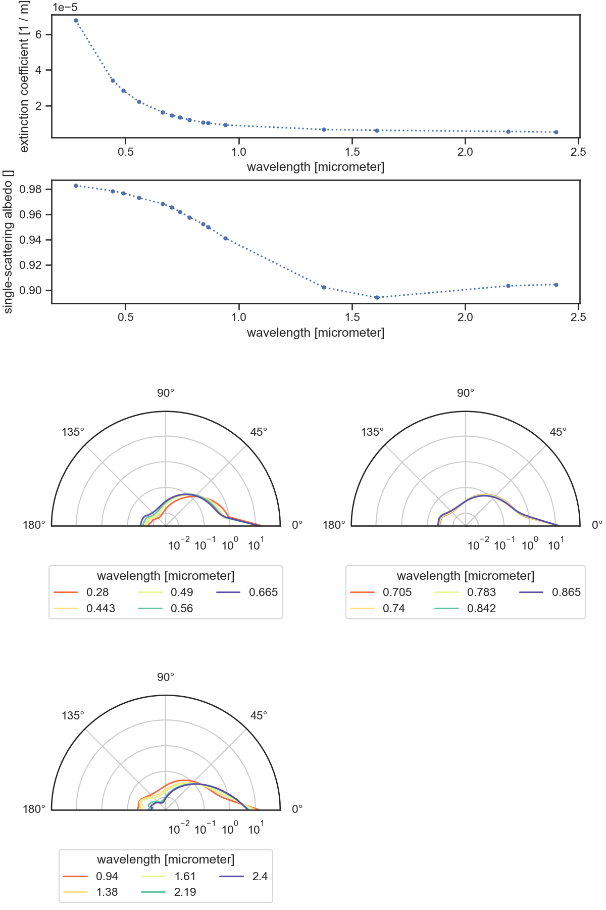
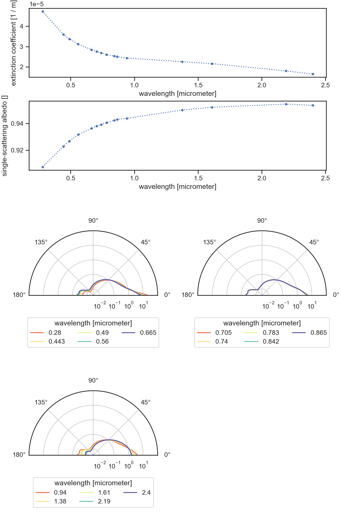

..
  This file was automatically generated by docs/generate_rst_data.py. The

      make docs-rst-data

  target automates this process.

Aerosol / particle single-scattering radiative properties
=========================================================

A particle radiative single-scattering property dataset provides collision 
coefficients and scattering phase matrix data for a given particle type. 
Eradiate's built-in particle radiative property datasets are managed by the 
data store (see :ref:`sec-data-intro` for details).

Format
------

* **Format** ``xarray.Dataset`` (in-memory), NetCDF (storage)
* **Dimensions**

  * ``w``: radiation wavelength
  * ``mu``: scattering angle cosine
  * ``i``: scattering phase matrix row index
  * ``j``: scattering phase matrix column index

* **Coordinates** (all dimension coordinates; when relevant, ``units`` are 
  required and specified in the units metadata field)

  * ``w`` float [length]
  * ``mu`` float [dimensionless]
  * ``i``,  ``j`` int

* **Data variables** (when relevant, units are required and  specified in the 
  units metadata field)

  * ``sigma_t`` (``w``): volume extinction coefficient [length^-1]
  * ``albedo`` (``w``): single-scattering albedo [dimensionless]
  * ``phase`` (``w``, ``mu``, ``i``, ``j``): scattering phase matrix 
    [steradian^-1]

* **Conventions**

  * Phase matrix components use C-style indexing (from 0).

.. dropdown:: Full validation schema

   .. literalinclude:: /resources/data_schemas/particle_dataset_v1.yml

Dataset index
-------------

``govaerts_2021-continental-extrapolated``
^^^^^^^^^^^^^^^^^^^^^^^^^^^^^^^^^^^^^^^^^^

Filename: ``spectra/particles/govaerts_2021-continental-extrapolated.nc``

*No description available.*

``govaerts_2021-desert-extrapolated``
^^^^^^^^^^^^^^^^^^^^^^^^^^^^^^^^^^^^^

Filename: ``spectra/particles/govaerts_2021-desert-extrapolated.nc``

*No description available.*

