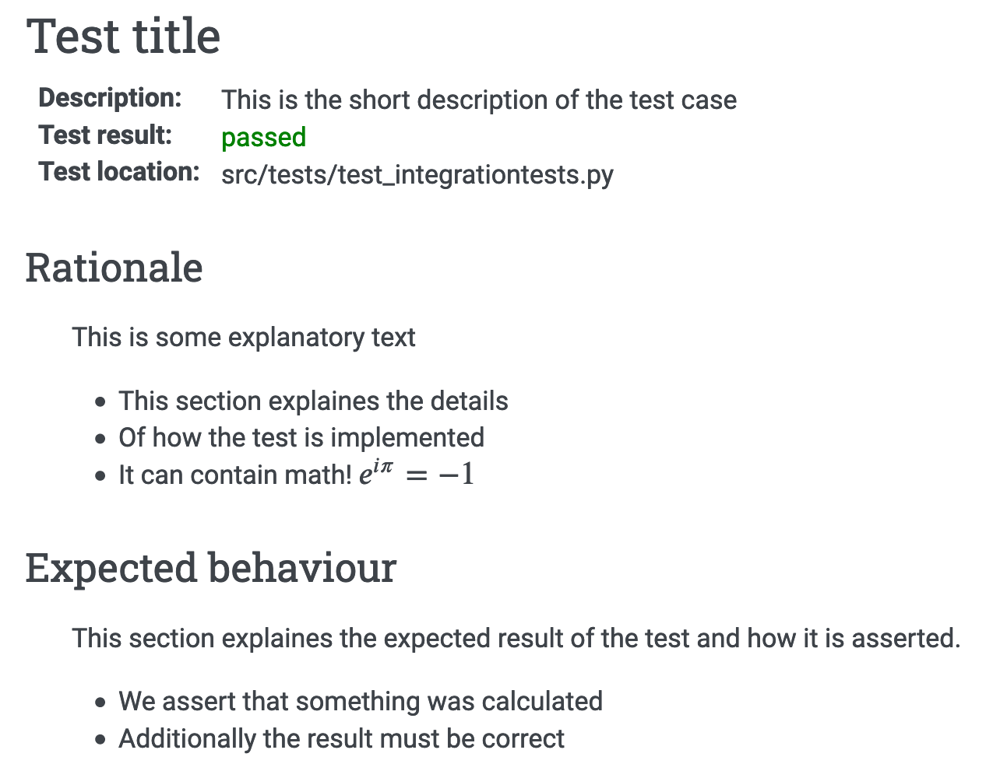

.. _sec-developer_guide-testing:

Testing and test report
=======================

Eradiate is shipped with a series of tests written with `pytest <https://docs.pytest.org/en/latest/>`_.

Running the tests
-----------------

To run the test suite, invoke ``pytest`` with the following command:

.. code-block:: bash

    pytest eradiate

The Mitsuba test suite can also be run:

.. code-block:: bash

    pytest ext/mitsuba2/src
    
Test report
-----------

Eradiate can generate an HTML based test report, collecting information about the number of tests, their outcome and which will collect the test specification for more complex test cases, such as integration and system tests.

.. code-block:: bash

   python test_report/generate_report.py

The resulting report will be located in
``$ERADIATE_SOURCE_DIR/build/html_test-report``.

Testing guidelines
------------------

Writing test specification
^^^^^^^^^^^^^^^^^^^^^^^^^^

Eradiate's tests can be roughly categorised as follows:

- unit tests focus on the smallest testable units of code;
- integration tests assess the interaction between several components;
- system tests check the behaviour of entire applications.

While categorising each individual test is not always an easy task, this nomenclature highlights the fact that tests have varied degrees of complexity. When the rationale, setup and course of action of a test is not obvious by reading the corresponding source code, properly documenting it in a structured way is crucial. For this reason, Eradiate defines a test description template to be used for integration and system tests. Documented tests have a dedicated section in the test report.

The test specification consists of three main parts: the **description of the test rationale**, the **details of the setup**, explaining in prose, how a test is designed and, finally, the **expected outcome** of the test, which describes based on what the test should pass or fail. 

The following template can be copied to new test cases and the information filled in as needed. Note that we strongly suggest using literal strings (prefixed with a ``r``) in order to avoid issues with escape sequences.

.. code-block:: none

    r"""
    Test title
    ----------
    
    :Description: This is the short description of the test case
    
    Rationale
    ^^^^^^^^^

        This is some explanatory text

        - This section explaines the details
        - Of how the test is implemented
        - It can contain math! :math:`e^{i\pi}=-1`

    Expected behaviour
    ^^^^^^^^^^^^^^^^^^

        This section explaines the expected result of the test and how it is asserted.

        - We assert that something was calculated
        - Additionally the result must be correct
        
    """

The test specification can hold any valid restructured text. A quick rundown on that can be found
`here <https://www.sphinx-doc.org/en/master/usage/restructuredtext/basics.html>`_ .

Upon report generation, the test result and location of the test file will
be added and the result will look similar to this:

The test specification of unit tests is not parsed for the test report and does not have to comply with these guidelines. For those a short explanation is sufficient, but the three general parts mentioned above should still serve as a guideline for relevant and helpful test specification.
