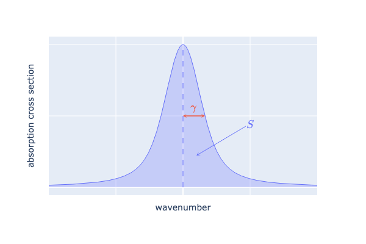

.. _sec-atmosphere-molecular-absorption:

Molecular absorption
====================

There are several models to compute molecular absorption:

* the *monochromatic model*, also known as the *line-by-line model*,
* *band models*, such as the *CKD model* :cite:`Fu1992CorrelatedDistributionMethod`.

Currently, Eradiate supports two spectral modes, which are ``mono`` and ``ckd``.
In the ``mono`` mode, molecular absorption is computed using the monochromatic model.
In the ``ckd`` mode, molecular absorption is computed using the CKD model.

Monochromatic model
-------------------

In the monochromatic model, the air monochromatic volume absorption coefficient,
:math:`\sigma_{\mathrm a \lambda} \, [L^{-1}]`,
due to :math:`N` absorbers, is computed using the equation:

.. math::
   :label: mono_k

   \sigma_{\mathrm{a} \lambda} (\nu, p, T, \vec{x}) = \sum_{i=0}^{N-1} \, x_i \, n \,
   C_{\mathrm{a}i}(\nu, p, T, \vec{x})

where

* :math:`\nu` is the wavenumber :math:`[L^{-1}]`,
* :math:`p` is the pressure :math:`[ML^{-1}T^{-2}]`,
* :math:`T` is the temperature :math:`[\Theta]`,
* :math:`\vec{x}` is the absorbers volume fraction vector, whose components are
  the individual absorbers volume fractions in air, :math:`x_i` :math:`[/]`,
* :math:`n` is the air number density :math:`[L^{-3}]`, and
* :math:`C_{\mathrm {ai}}` is the monochromatic absorption cross section
  :math:`[L^2]`, of the :math:`i`-th absorber.

.. note::
   The sum of the absorbers volume fractions can be less than 1 due to the
   presence of non-absorbing molecular species in the air, *i.e.*,
   :math:`x_i` must satisfy:

   .. math::

      \sum_{i=0}^{N-1} \, x_i \leq 1
      

In :eq:`mono_k`, the monochromatic absorption cross section values
:math:`C_{\mathrm {a}i}` are computed by interpolating
the absorption cross section data set that corresponds to the absorber
on the wavenumber, pressure and temperature axes.

Wait, what?
^^^^^^^^^^^

Indeed, the absorption cross section data set is interpolated on the
wavenumber axis.

In theory, interpolating the absorption cross section spectrum of a gas
requires the spectrum to have a very high resolution, because the absorption
spectrum typically includes numerous fine features, referred to as *absorption lines*.
Absorption lines are characterised by an intensity denoted :math:`S`
(area under the line curve) and a half-width at half-maximum denoted
:math:`\gamma`, as illustrated below.

In standard conditions (101325 Pa, 300 K), :math:`\gamma` is around
:math:`10^{-2} \mathrm{cm}^{-1}` for CO2 and H2O
:cite:`Taine2014TransfertsThermiquesIntroduction`,
but changes with pressure and temperature (and also with the absorber) and
generally decreases with increasing altitudes.
In order to resolve each line, the spectrum must be computed at a resolution
better than :math:`\gamma`, e.g.
:math:`3 \, 10^{-3} \mathrm{cm}^{-1}`
if :math:`\gamma = 10^{-2} \mathrm{cm}^{-1}`.
Good and bad spectral resolutions are illustrated below.

.. image:: fig/good_resolution.png
   :align: center

.. image:: fig/bad_resolution.png
   :align: center

.. note::

   At the moment, molecular absorption is only available for the so-called
   ``us76_u86_4`` absorber and targets the *U.S. Standard Atmosphere, 1976*
   thermophysical properties.

   We are currently working on a solution to make available monochromatic
   absorption cross section data sets for individual molecules.

CKD model
---------

.. warning::
   We are not yet done writing this section. Stay tuned for updates!
