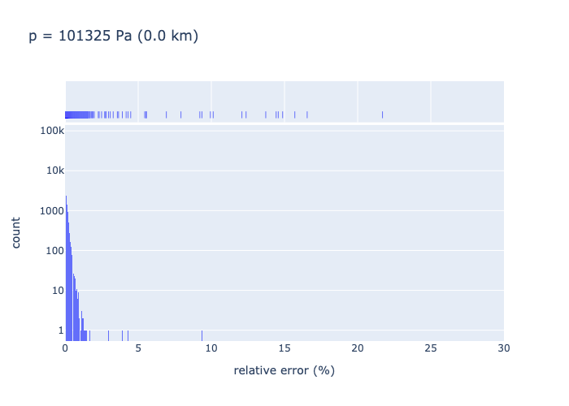
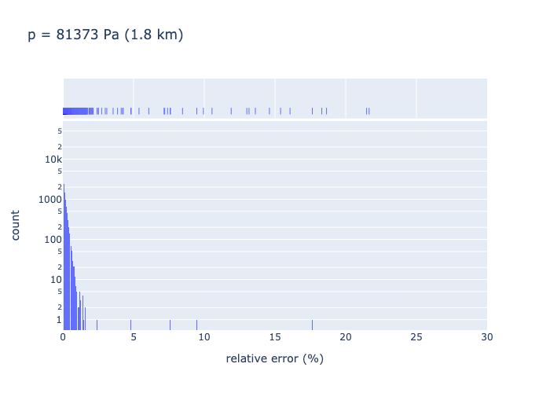
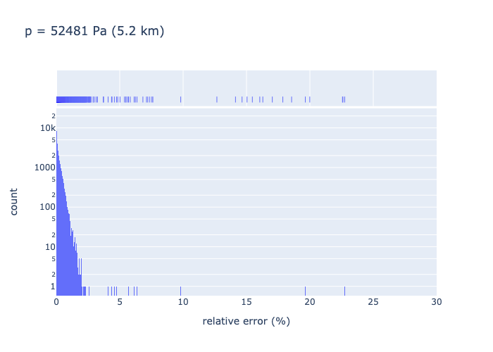
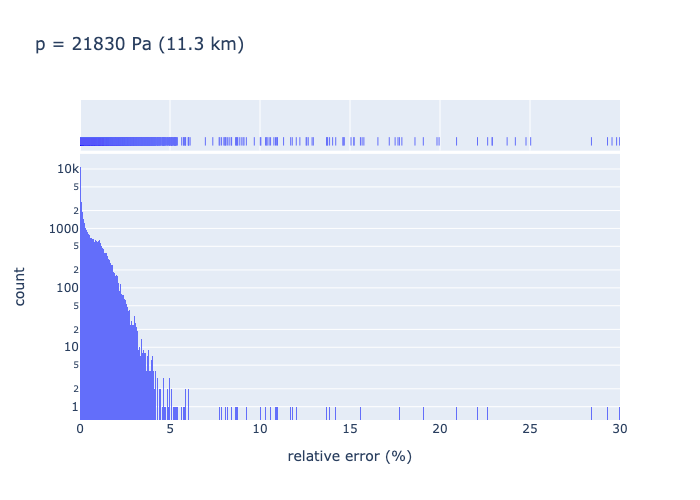
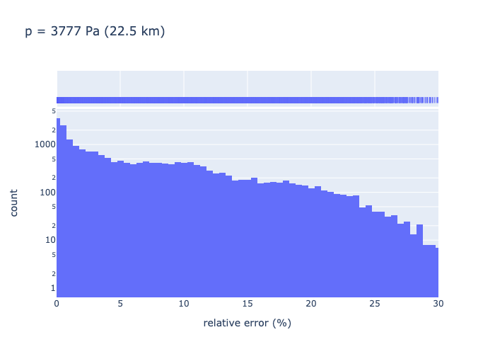
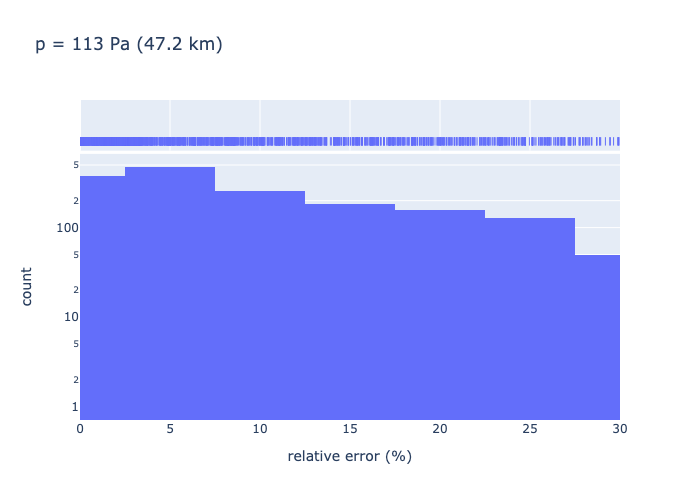
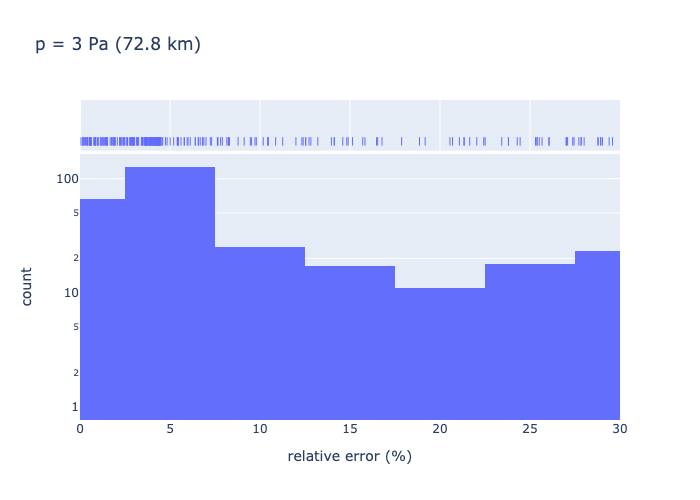

.. _sec-atmosphere-molecular-absorption:

Molecular absorption
====================

There are several ways to compute molecular absorption.
The most general and accurate way is the *monochromatic model*, also known as
the *line-by-line model*.
There are also approximate models, such as the *CK model*, which are less
accurate but faster.
:cite:`Taine2014TransfertsThermiquesIntroduction`.

Monochromatic model
-------------------

In monochromatic mode, the monochromatic model is used.
In the monochromatic model, the air monochromatic absorption coefficient,
:math:`k_{\mathrm a \lambda} \, [L^{-1}]`,
due to :math:`N` absorbers, is computed using the equation:

.. math::

   k_{\mathrm a \lambda} (p, T, \vec{x}) = \sum_{i=0}^{N-1} \, x_i \, n \,
   \sigma_{\mathrm{ai}}(\nu, p, T)

where

* :math:`n` is the air number density :math:`[L^{-3}]`,
* :math:`\sigma_{\mathrm {ai}}` is the monochromatic absorption cross section
  :math:`[L^2]`, of the :math:`i` -th absorber,
* :math:`\nu = \lambda^{-1}` is the wavenumber :math:`[L^{-1}]`,
* :math:`p` is the pressure :math:`[ML^{-1}T^{-2}]`,
* :math:`T` is the temperature :math:`[\Theta]` and
* :math:`x_i` is the volume fraction :math:`[/]` of the :math:`i` -th absorber
  in air (:math:`\vec{x}` is the vector whose constituents are :math:`x_i`).

Note that the sum of the absorbers volume fractions is not necessarily 1,
because there are some non-absorbing species in the air:

.. math::

   \sum_{i=0}^{N-1} x_i \leq 1

.. note::

   Absorbers can be mixtures of absorbers.

The monochromatic absorption cross section values are computed by interpolating
the absorption cross section data set that corresponds to the absorber
on the wavenumber, pressure and temperature axes.

Wait, what?
^^^^^^^^^^^

Indeed, the absorption cross section data set is interpolated on the
wavenumber axis.
In theory, interpolating the absorption cross section spectrum of a gas
requires the spectrum to have a very high resolution, because the spectrum
typically includes numerous fine features called *lines*.
Absorption lines are characterised by an intensity (area under the line curve)
and a half-width at half-maximum (:math:`\gamma`).
In standard conditions (101325 Pa, 300 K), :math:`\gamma` is around
:math:`10^{-2} \mathrm{cm}^{-1}` for CO2 and H2O
:cite:`Taine2014TransfertsThermiquesIntroduction`,
but changes with pressure and temperature (and also with the absorber) and
generally decreases with increasing altitudes.
In order to resolve each line, the spectrum must be computed at a resolution
better than :math:`\gamma`, e.g.
:math:`3 \, 10^{-3} \mathrm{cm}^{-1}`
if :math:`\gamma = 10^{-2} \mathrm{cm}^{-1}`.

.. note::

   At the moment, molecular absorption is only computed for the so-called
   ``us76_u86_4`` absorber and within the
   :mod:`us76 <eradiate.thermoprops.us76>` thermophysical properties profile.

   We are currently working on the functionality to compute absorption by the
   following individual gas species: H2O, CO2, O3, N2O, CO, CH4 and O2.

``us76_u86_4``
~~~~~~~~~~~~~~

The ``us76_u86_4`` absorber is a gas mixture defined by the mixing ratios
provided in the table below.
Each gas species in this gas mixture is an absorber.
The ``us76_u86_4`` is named in this way because it corresponds to the
gas mixture defined by the ``us76`` atmosphere model
:cite:`NASA1976USStandardAtmosphere` in the region of altitudes below 86 km,
and restricted to the 4 main molecular species, namely N2, O2, CO2 and CH4.

.. list-table::
   :widths: 2 1 1 1 1

   * - Species
     - N2
     - O2
     - CO2
     - CH4
   * - Mixing ratio [%]
     - 78.084
     - 20.9476
     - 0.0314
     - 0.0002

Monochromatic absorption by the ``us76_u86_4`` gas mixture is computed by
interpolating the absorption cross section data set ``spectra-us76_u86_4`` in
wavenumber and pressure.

The absorption cross sections in this data set were computed using the
`SPECTRA <https://spectra.iao.ru>`_
Information System, which uses the HITRAN database (2016-edition)
:cite:`Gordon2016HITRAN2016MolecularSpectroscopic`.
The data set is not interpolated on temperature because the temperature
coordinate is mapped onto the pressure coordinate according to the
pressure-temperature relationship defined by the ``us76`` thermophysical
profile.
In other words, when interpolating the data set in pressure, the
temperature coordinate is automatically set to the appropriate value.
This is why this data set is tied to the ``us76`` thermophysical profile.

The ``spectra-us76_u86_4`` data set covers the wavenumber and pressure ranges
indicated in the table below:

.. list-table::
   :widths: 1 1 1
   :header-rows: 1

   * -
     - Minimum value
     - Maximum value
   * - Wavenumber [cm :math:`^{-1}`]
     - 4000
     - 25711
   * - Wavelength [nm]
     - 390
     - 2500
   * - Pressure [atm]
     - :math:`10^{-6}`
     - 1
   * - Pressure [Pa]
     - 0.101325
     - 101325

The minimum pressure value of :math:`10^{-6}` atm corresponds to a maximum
altitude of approximately 93 km, in the ``us76`` thermophysical profile.
This minimum value is a restriction of SPECTRA.
For higher altitudes, that is to say for lower pressure values, the absorption
cross section value is approximated to 0.

.. note::

   Given that the maximum value of the absorption cross section at 93 km is:

   .. math::

      \max_{\nu} \sigma_{a} = 9.62 \, 10^{-23} \, \mathrm{cm}^2,

   which corresponds to a maximal absorption coefficient value of:

   .. math::

      \max_{\nu} k_{a} = 4.0 \, 10^{-4} \, \mathrm{km}^{-1},

   this approximation seems reasonable.

Accuracy of the spectral interpolation
^^^^^^^^^^^^^^^^^^^^^^^^^^^^^^^^^^^^^^
The spectral resolution of the ``spectra-us76_u86_4`` absorption data set is
:math:`3.14 \, 10^{-3} \mathrm{cm}^{-1}`.
To assess the accuracy of the wavenumber interpolation of the data set, we
downsampled the data set on a wavenumber mesh that has a resolution twice lower,
i.e. :math:`6.28 \, 10^{-3} \mathrm{cm}^{-1}`, by taking only the wavenumber
values with even indices.
We then interpolated the downsampled data set on the odd-indices wavenumber
and assessed the interpolation accuracy by comparing the cross section values
in the downsampled data set with the values in the original data set, taken as
the reference value.
Since the assessed interpolation accuracy here is that of the downsampled
data set, we assume that the interpolation accuracy of the original data set is
better.
For each odd-index wavenumber and for each pressure values in the data set, we
assess the spectral interpolation accuracy by computing the relative errors:

.. math::

   \epsilon(\nu_i, p) =
   \frac{
      \lvert
      \sigma_{\mathrm{a, interpolated}}(\nu_i, p)
      - \sigma_{\mathrm{a, original}}(\nu_i, p)
      \rvert}{
      \sigma_{\mathrm{a, original}}(\nu_i, p)}

where:

* :math:`\sigma_{\mathrm{a, original}}` is the original data set cross section,
* :math:`\sigma_{\mathrm{a, interpolated}}` is the interpolated downsampled data
  set cross section,
* :math:`\nu_i` is  :math:`i` -th wavenumber, where :math:`i` is odd and
* :math:`p` is the pressure.

We discard the cross section data where the following condition is met:

.. math::
   :label: negligible_k

   k_{\mathrm{a}}(\nu_{i}, p) < 10^{-3} \, \mathrm{cm}^{-1},

where :math:`k_{\mathrm{a}}(\nu_{i}, p)` is computed with:

.. math::

   k_{\mathrm{a}}(\nu_{i}, p) = n(p) \, \sigma_{\mathrm{a}}(\nu_{i}, p)

where :math:`n(p)` is the number density corresponding to the pressure :math:`p`
in the ``us76`` thermophysical profile.

We apply :eq:`negligible_k` because we estimate that these absorption coefficient
values are too small to influence radiative transfer computations significantly.

.. note::

   By interpolating the downsampled absorption cross section data set at the
   odd-index wavenumber values, we maximise the interpolation error
   with respect to the reference data set.

The resulting relative errors histograms are illustrated below, for some
pressure values (corresponding altitude between brackets):

We make the following observations:

* At standard pressure (ground level altitude), the interpolation accuracy is
  relatively good -- better than 2 % except for some outliers.
* Up to altitudes ~ 10 km the interpolation accuracy remains fine -- better than
  5 % except for outliers.
* For pressure corresponding to 10 km altitude and higher, the interpolation
  accuracy gets poorer, although the errors counts decrease at the same time.
* As the pressure decreases (corresponding altitude increases), the interpolation
  accuracy gets poorer and poorer.

.. note::

   The counts number decreases with decreasing pressure because lower pressure
   means lower number density hence fewer absorption cross section data points
   satisfy :eq:`negligible_k`.

.. note::

   It must be reminded that the interpolation accuracy that is assessed here is
   that of the downsampled data set. We can expect improved accuracy for the
   actual data set.

Accuracy of the pressure interpolation
^^^^^^^^^^^^^^^^^^^^^^^^^^^^^^^^^^^^^^

Approximate models
------------------

.. note::
   The support for approximate models is currently ongoing work.
