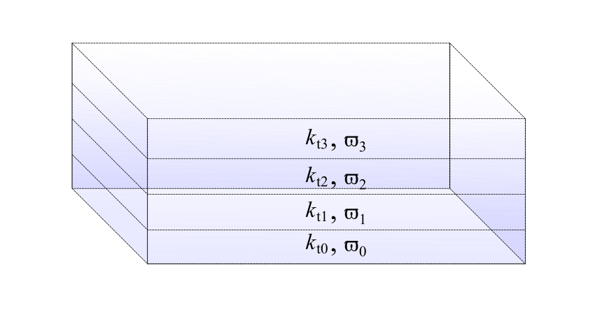
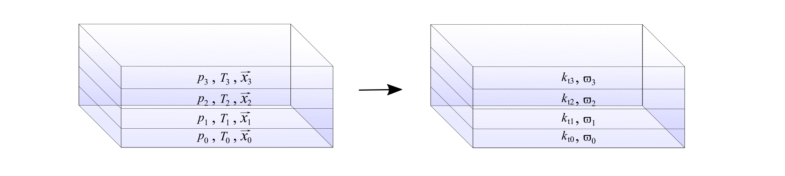

.. _sec-atmosphere-heterogeneous:

Heterogeneous atmospheres
=========================

The heterogeneous atmosphere is a heterogeneous participating medium
characterised by non-uniform radiative properties.
The non-uniform radiative properties of the heterogeneous atmosphere are
described by the radiative properties profile, which consists of the two
spatial fields

* :math:`\varpi (x,y,z)` and
* :math:`k_{\mathrm{t}} (x,y,z)`

where:

* :math:`\varpi` is the albedo :math:`[/]` and
* :math:`k_{\mathrm{t}}` is the extinction coefficient :math:`[L^{-1}]`.

.. note::

   So far, only 1D-heterogeneous atmospheres are available.
   The radiative properties profile thus consists of the spatial fields
   :math:`\varpi (z)` and
   :math:`k_{\mathrm{t}} (z)`

The scattering phase function is set to the
:ref:`Rayleigh scattering phase function <sec-atmosphere-molecular-scattering>`
(with a depolarisation factor set to zero) within the whole atmosphere.

The :class:`~eradiate.scenes.atmosphere.HeterogeneousAtmosphere` constructor
requires that you provide the radiative properties profile using either

* a :class:`~eradiate.radprops.rad_profile.RadProfile` object or
* kernel volume data files.

.. seealso:: For more details on how to create a heterogeneous atmosphere,
   checkout the
   :ref:`sphx_glr_examples_generated_tutorials_atmosphere_02_heterogeneous.py`
   tutorial.

Radiative properties profiles objects
-------------------------------------

There are several types of radiative properties profile objects.

``afgl1986``
~~~~~~~~~~~~

The :class:`~eradiate.radprops.rad_profile.AFGL1986RadProfile` 
(identifier: ``afgl1986``) class allows to create an atmosphere radiative
properties profile corresponding to the AFGL (1986)
:cite:`Anderson1986AtmosphericConstituentProfiles`
atmosphere thermophysical properties profile models.

``array``
~~~~~~~~~

The :class:`~eradiate.radprops.rad_profile.ArrayRadProfile`
(identifier: ``"array"``)
class is a fully-customisable radiative properties profile, where you specify
directly the radiative properties as arrays of extinction coefficient and
albedo values.

``us76_approx``
~~~~~~~~~~~~~~~

The
:class:`~eradiate.radprops.rad_profile.US76ApproxRadProfile`
(identifier: ``"us76_approx"``)
class represents an approximation of the radiative properties profile
corresponding to the :mod:`~eradiate.thermoprops.us76` atmosphere
thermophysical model.

Radiative properties profile derived from a thermophysical properties profile
-----------------------------------------------------------------------------

The ``afgl1986`` and ``us76_approx`` radiative properties profiles are derived
from their corresponding thermophysical properties profiles as illustrated by
the figure below.

On the left is represented the thermophysical properties profile.
For illustration purposes, only 4 layers are included.
The thermophysical properties serve as inputs to the functions that compute the
radiative properties profile.
On the right is represented the corresponding radiative properties profile.
In each atmospheric layer, the radiative properties are computed using
the corresponding thermophysical properties.
For example, in the second atmospheric layer (labeled with the subscript 1) in
the figure above, the values of :math:`k_{\mathrm{t}1}` and :math:`\varpi_{1}`
are computed at a pressure value given by :math:`p_1`, a temperature value given
by :math:`T_1` and mixing ratios specified by :math:`\vec{x}_1`.
Thus, the radiative properties profile is connected with the thermophysical
properties profile.

.. _sec-atmosphere-heterogeneous-kernel_volume_data_files:

Kernel volume data files
------------------------

.. note::
   This section is about advanced usage.

When the heterogeneous atmosphere object is created, the radiative properties
are written to files, which can be accessed afterwards.
The locations of these data files is stored in the ``albedo_fname`` and
``sigma_t_fname`` attributes.
By default, these files are placed in a temporary directory with a random name.
To control where these files are saved, set the ``albedo_fname`` and
``sigma_t_fname`` attributes by providing the paths to these files.
Later, you can re-use these files to create the same heterogeneous atmosphere
by setting the ``albedo_fname`` and ``sigma_t_fname`` attributes to the paths
pointing to the files to use.

.. warning::
   Since the kernel volume data files only hold the radiative properties, you
   must (remember and) specify the ``toa_altitude`` corresponding to the
   initial atmosphere, in order to reproduce it.
