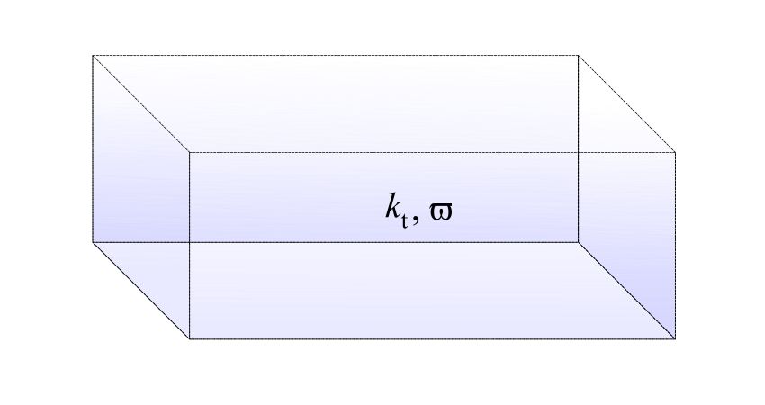

.. _sec-atmosphere-homogeneous:

Homogeneous atmospheres
=======================

To create a homogeneous atmosphere, simply call the constructor of the
:class:`~eradiate.scenes.atmosphere.HomogeneousAtmosphere` class from the
:mod:`~eradiate.scenes.atmosphere` package:

.. code:: python

   import eradiate
   atmosphere = eradiate.scenes.atmosphere.HomogeneousAtmosphere()

This will built a homogeneous atmosphere with default parameters.
These default parameters are:
By default, the homogeneous atmosphere is 100 km high and has an absorption
coefficient (``sigma_a``) set to zero.
The value of the scattering coefficient depends on the current wavelength.
You must set a wavelength value before ``sigma_s`` can be computed:

.. code:: python

   eradiate.set_mode("mono", wavelength=550.)

The value of ``sigma_s`` is computed by
:func:`compute_sigma_s_air() <eradiate.radprops.rayleigh.compute_sigma_s_air>`.
In the above example, the corresponding value is approximately
:math:`1.15 \, 10^{-2} \, \mathrm{km}^{-1}`
By default, the atmosphere width is automatically computed from the value of
the scattering coefficient, using the formula:

.. math::

   w = 10 \, \tau_{\mathrm{s}},

where

.. math::

   \tau_{\mathrm{s}} = k_{\mathrm{s}}^{-1},

is the scattering mean free path :math:`[L]`.
In our example, the computed width is approximately 870 km.

If you want, you can set these parameters to the values of your choice.
Below, we specify a 1000 x 1000 x 120 km homogeneous atmosphere with
:math:`k_{\mathrm{s}} = 10^{-3} \, \mathrm{km}^{-1}` and
:math:`k_{\mathrm{a}} = 10^{-5} \, \mathrm{km}^{-1}`:

   .. code:: python

      from eradiate import unit_registry as ureg

      atmosphere = eradiate.scenes.atmosphere.HomogeneousAtmosphere(
          toa_altitude = ureg.Quantity(120, "km"),
          width = ureg.Quantity(1000, "km"),
          sigma_s = ureg.Quantity(1e-3, "km^-1"),
          sigma_a = ureg.Quantity(1e-5, "km^-1"),
      )
