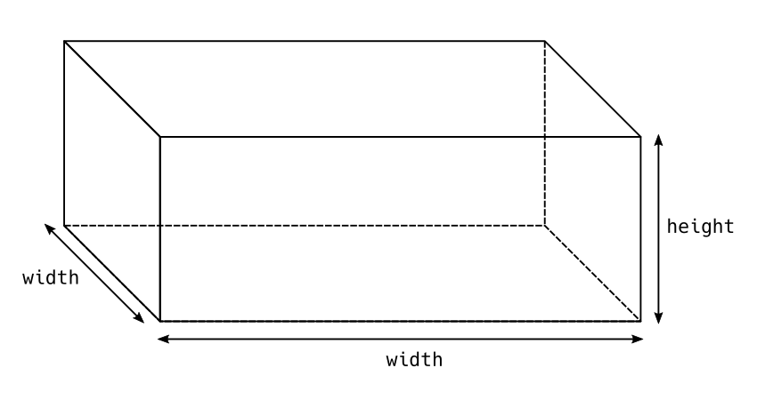
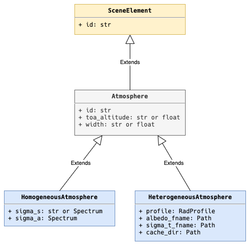

.. _sec-atmosphere-intro:

Introduction
============

Assumptions
-----------

The air is assumed to behave as an
`ideal gas <https://en.wikipedia.org/wiki/Ideal_gas>`_,
*i.e.* a collection of point particles without interactions between one another.
It is in thermodynamic equilibrium, it is not chemically reacting and it obeys
the ideal gas state equation:

.. math::

   p = n k T

where:

* :math:`p` stands for the pressure :math:`[ML^{-1}T^{-2}]`,
* :math:`n` stands for the number density :math:`[L^{-3}]`,
* :math:`k` is the
  `Bolzmann constant <https://en.wikipedia.org/wiki/Boltzmann_constant>`_
  :math:`[ML^{2}T^{-2}\Theta^{-1}]` and
* :math:`T` stands for the temperature :math:`[\Theta]`.

Air can usually be treated as an ideal gas within reasonable tolerance over a
wide parameter range around standard temperature and pressure (273 K, 100 kPa)
and the approximation generally gets better with lower pressure and higher
temperature.

Atmosphere modelling
--------------------

Eradiate represents the atmosphere as a **shape** that encompasses a
**participating medium** (the air).

The shape is a cuboid characterised by width and height values that correspond
to the width and height, respectively, of the atmosphere object.

This shape delimits the region of space that is occupied by the participating
medium.

The participating medium is characterised by a phase function type and two 3D
arrays of albedo and extinction coefficient values that describe how
radiative properties vary in space.

.. image:: fig/atmosphere-participating_medium.png
   :align: center
   :scale: 50

Each value in these 3D arrays corresponds to one cell of a spatial mesh that
discretises the participating medium into an arrangement of adjacent 3D cells
wherein the radiative properties are uniform.
In the example illustrated by the image above, the shape of these arrays would
be (4, 2, 2).
The extinction coefficient (:math:`k_{\mathrm{t}}`) and albedo (:math:`\varpi`)
are defined by:

.. math::

   k_{\mathrm{t}} = k_{\mathrm{s}} + k_{\mathrm{a}}

.. math::

   \varpi = \frac{k_{\mathrm{s}}}{k_{\mathrm{t}}}

where:

* :math:`k_{\mathrm{a}}` is the absorption coefficient :math:`[L^{-1}]` and
* :math:`k_{\mathrm{s}}` is the scattering coefficient :math:`[L^{-1}]`.

The phase function does not vary from one cell to the other; it is the same
for the whole atmosphere.
Only the albedo and extinction coefficient are allowed to vary with space.

The structure of the participating medium is assumed to be isotropic, *i.e.* the
properties of the medium embedded in one cell is invariant to rotation of the
cell.

.. note::
   So far, only purely molecular atmospheres are supported.
   Work on adding aerosols to the atmosphere is ongoing.

Atmosphere types
----------------

Eradiate provides two atmosphere types:

* homogeneous atmosphere
  (:class:`~eradiate.scenes.atmosphere.HomogeneousAtmosphere`): radiative
  properties are uniform within the atmosphere.
* heterogeneous atmosphere
  (:class:`~eradiate.scenes.atmosphere.HeterogeneousAtmosphereLegacy`): radiative
  properties are non-uniform within the atmosphere.

Both atmosphere types inherit an abstract atmosphere base type
(:class:`~eradiate.scenes.atmosphere.Atmosphere`),
parameterised by a top-of-atmosphere altitude (``toa_altitude``) and a width
(``width``).
As a result, these parameters can be set for both atmosphere types.
Both atmosphere types use the
:ref:`Rayleigh scattering phase function <sec-atmosphere-molecular-scattering>`
to describe the angular distribution of scattered light.
Each atmosphere type is further characterised by additional specific parameters.
For more information, refer to the following guide pages:

* :ref:`Homogeneous atmospheres <sec-atmosphere-homogeneous>`.
* :ref:`Heterogeneous atmospheres <sec-atmosphere-heterogeneous>`.
