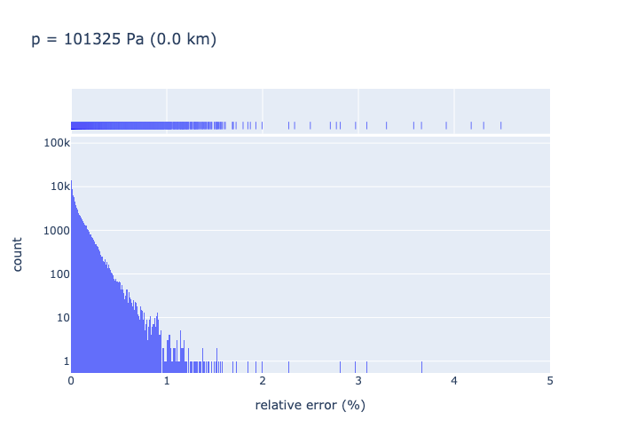
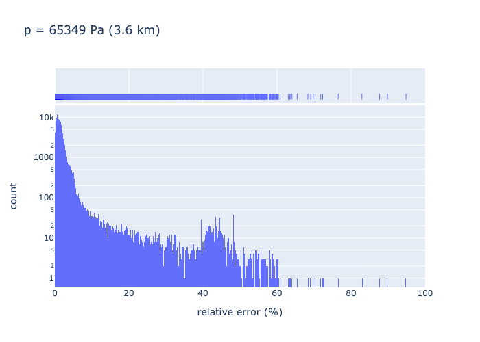

.. _sec-user_guide-data-spectra_us76_u86_4:

``us76_u86_4-spectra``
======================

The ``us76_u86_4-spectra`` data set is an absorption cross section data set
for the the ``us76_u86_4`` absorbing gas mixture and computed using the
`SPECTRA <https://spectra.iao.ru>`_ Information System.

Description
-----------

Absorber
^^^^^^^^

The ``us76_u86_4`` absorber is a gas mixture defined by the mixing ratios
provided in the table below.

.. list-table::
   :widths: 2 1 1 1 1

   * - Species
     - N2
     - O2
     - CO2
     - CH4
   * - Mixing ratio [%]
     - 78.084
     - 20.9476
     - 0.0314
     - 0.0002

Each gas species in this gas mixture is an absorber.
The ``us76_u86_4`` absorber is named in this way because it corresponds to the
gas mixture defined by the ``us76`` atmosphere model
:cite:`NASA1976USStandardAtmosphere` in the region of altitudes below 86 km,
and restricted to the 4 main molecular species, namely N2, O2, CO2 and CH4.

Data source
^^^^^^^^^^^

The absorption cross sections data in this data set were computed using the
`SPECTRA <https://spectra.iao.ru>`_
Information System, with inputs available
`here <https://eradiate.eu/data/us76_u86_4-spectra-inputs.zip>`_.
SPECTRA uses the HITRAN database (2016-edition)
:cite:`Gordon2016HITRAN2016MolecularSpectroscopic`.

Structure
^^^^^^^^^

The ``us76_u86_4-spectra`` data set includes two data variables:

* absorption cross section (``xs``)
* mixing ratios (``mr``)

and three
`dimension coordinates <https://xarray.pydata.org/en/stable/user-guide/data-structures.html#coordinates>`_:

* wavenumber (``w``)
* pressure (``p``) and
* molecule (``m``).

The absorption cross section data variable is tabulated with respect to the
wavenumber and pressure coordinates.
The mixing ration data variable is tabulated with respect to the pressure and
molecule coordinates.

.. note::

   The data set does not include a temperature dimension coordinate because the
   temperature coordinate is mapped onto the pressure coordinate according to the
   pressure-temperature relationship defined by the ``us76`` thermophysical
   profile.
   This is why this data set is tied to the ``us76`` thermophysical profile.

   The graph below illustrates the pressure and temperature points used to
   compute the absorption cross section.
   There are 64 points (in red).
   The pressure values are geometrically spaced between
   :math:`10^{-6} \mathrm{atm}` (:math:`0.101325 \mathrm{Pa}`) and
   :math:`1 \mathrm{atm}` (:math:`101325 \mathrm{Pa}`).
   The temperature values are defined as the ordinate values when the abscissa
   values are set to these 64 pressure values, and the pressure-temperature
   relationship is given by the US76 model (blue curve).

   .. image:: fig/pt_points.png
      :align: center

Wavenumber coordinate
~~~~~~~~~~~~~~~~~~~~~
The wavenumber coordinate is a linearly spaced mesh between
:math:`4000 \, \mathrm{cm}^{-1}` (:math:`2500 \, \mathrm{nm}`) and
:math:`25711 \, \mathrm{cm}^{-1}` (:math:`390 \, \mathrm{nm}`)
with a constant wavenumber step of
:math:`0.01 \, \mathrm{cm}^{-1}` (corresponding wavelength step varies
between
:math:`~ 0.00015 \, \mathrm{nm}` and
:math:`~ 0.006 \, \mathrm{nm}`).

Pressure coordinate
~~~~~~~~~~~~~~~~~~~

The pressure coordinate is a geometrically spaced mesh between
:math:`0.101325 \, \mathrm{Pa}` (:math:`10^{-6} \, \mathrm{atm}`) and
:math:`101325 \, \mathrm{Pa}`
with 64 mesh points.

The minimum pressure value of :math:`10^{-6} \, \mathrm{atm}` corresponds to a
maximum altitude of approximately 93 km, in the ``us76`` thermophysical profile.
This minimum value is a restriction of SPECTRA.
For higher altitudes, that is to say for lower pressure values, the absorption
cross section value is approximated to 0.

.. note::

   Given that the maximum value of the absorption cross section at 93 km is:

   .. math::

      \max_{\nu} \sigma_{a} \approx 9 \, 10^{-23} \, \mathrm{cm}^2,

   which corresponds to a maximal absorption coefficient value of:

   .. math::

      \max_{\nu} k_{a} \approx 4 \, 10^{-4} \, \mathrm{km}^{-1},

   this approximation seems reasonable.

Interpolation accuracy
----------------------

We assess the accuracy of the wavenumber and pressure interpolation of
the ``us76_u86_4-spectra`` absorption data set.

Method
^^^^^^

We down-sample the original data set on the corresponding axis, i.e. either
wavenumber or pressure, by selecting data corresponding to even-indices
coordinate values.
Then, we interpolate the down-sampled data set on the odd-indices coordinate
values.
We assess the interpolation accuracy by computing the relative errors:

.. math::
   :label: rerr

   \epsilon(p_i, q) =
   \frac{
      \lvert
      \sigma_{\mathrm{a, interpolated}}(p_i, q)
      - \sigma_{\mathrm{a, original}}(p_i, q)
      \rvert}{
      \sigma_{\mathrm{a, original}}(p_i, q)}

where:

* :math:`\sigma_{\mathrm{a, original}}` is the original data set absorption
  cross section,
* :math:`\sigma_{\mathrm{a, interpolated}}` is the interpolated down-sampled
  data set absorption cross section,
* :math:`p_i` is the interpolation coordinate (i.e. wavenumber or pressure)
  where :math:`i` is odd, and
* :math:`q` is the other coordinate (i.e. pressure or wavenumber).

.. note::
   Since the assessed interpolation accuracy here is that of the downsampled
   data set, we can expect that the interpolation accuracy of the original data
   set to be better.

We discard the cross section data where the following condition is met:

.. math::
   :label: negligible_k

   k_{\mathrm{a}}(\nu_{i}, p) < 10^{-3} \, \mathrm{cm}^{-1},

where :math:`k_{\mathrm{a}}(\nu_{i}, p)` is computed with:

.. math::

   k_{\mathrm{a}}(\nu_{i}, p) = n(p) \, \sigma_{\mathrm{a}}(\nu_{i}, p)

where :math:`n(p)` is the number density corresponding to the pressure :math:`p`
in the ``us76`` thermophysical profile.

We apply :eq:`negligible_k` because we estimate that these absorption coefficient
values are too small to influence radiative transfer computations significantly.

.. note::

   By interpolating the down-sampled absorption cross section data set at the
   odd-index coordinate values, we maximise the interpolation error
   with respect to the reference data set because each interpolation point is
   exactly at the middle of each data interval.
   This means that the relative errors are computed in the worst case scenarios,
   hence provide a conservative estimate of the interpolation accuracy.

Results
^^^^^^^

Below are illustrated some histograms of the values of :math:`\epsilon`
computed with :eq:`rerr`.

Wavenumber interpolation
~~~~~~~~~~~~~~~~~~~~~~~~

Below is given the histogram of the relative errors :math:`\epsilon (\nu_i, p)`
for :math:`p=101325 \, \mathrm{Pa}` when interpolating the down-sampled
data set on to the even-index wavenumber values of the original data set.

Pressure interpolation
~~~~~~~~~~~~~~~~~~~~~~

Below is illustrated the histogram of the relative errors
:math:`\epsilon(p_i, \nu)` for :math:`p_i = 65349 \, \mathrm{Pa}` and for all
wavenumbers values of the original data set.

Analysis
^^^^^^^^

Wavenumber interpolation
~~~~~~~~~~~~~~~~~~~~~~~~

We make the following observations:

* At standard pressure (ground level altitude), the interpolation accuracy is
  fine -- better than 5 % except for some outliers.
* As the pressure decreases (corresponding altitude increases), the interpolation
  accuracy gets poorer and poorer, although the errors counts decrease
  simultaneously.
* The counts number decreases with decreasing pressure because lower pressure
  means lower number density hence fewer absorption cross section data points
  satisfy :eq:`negligible_k`.

Pressure interpolation
~~~~~~~~~~~~~~~~~~~~~~

We make the following observations:

* At ~4 km altitude (:math:`p = 65349 \, \mathrm{Pa}`), the interpolation
  accuracy is relatively bad -- up to 50 % -- except for a few outliers.
* The interpolation accuracy generally improves with increasing altitudes
  (decreasing pressure).
* For altitudes ~ 21 km and higher (:math:`p < 4703 \, \mathrm{Pa}`), the
  interpolation accuracy is better than 5 %, except for some outliers.
* The counts number decreases with decreasing pressure because lower pressure
  means lower number density hence fewer absorption cross section data points
  satisfy :eq:`negligible_k`.

Conclusion
^^^^^^^^^^

It is not easy to draw any conclusion regarding the interpolation accuracy of
the ``us76_u86_4-spectra`` absorption data set from the above analysis.
Since the interpolation accuracy of the down-sampled data set is not quite
satisfactory, there is not guarantee that the interpolation accuracy of the
actual data set is.
On the other hand, the interpolation accuracy of the down-sampled data set was
estimated in the worst case scenarios, so that the average accuracy is in fact
better than the reported accuracy.
Nevertheless, we plan to generate a new version of the data set with finer
wavenumber and pressure meshes to improve the interpolation accuracy.
